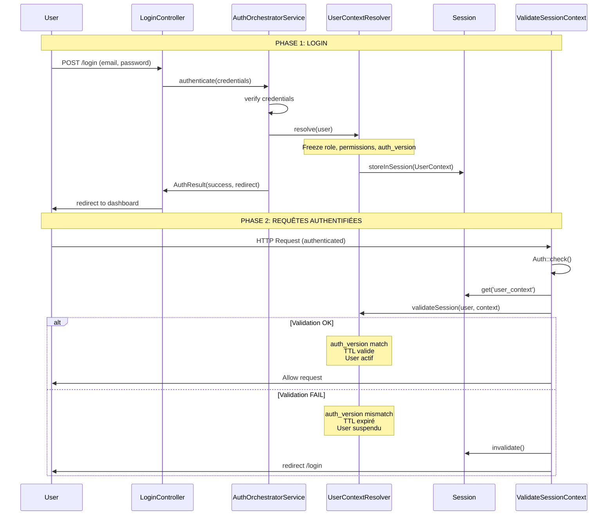

# FLUX D'AUTHENTIFICATION — DOCUMENTATION OFFICIELLE

**Version** : 1.0  
**Date** : 2026-01-17  
**Statut** : 📋 **RÉFÉRENCE OFFICIELLE**

---

## 🎯 OBJECTIF

Cette documentation décrit le **flux d'authentification réel** du système RACINE BY GANDA.

**Règles** :
- Toute modification du flux AUTH **DOIT** mettre à jour ce document
- Aucun bypass autorisé
- Ce document fait foi en cas de conflit

---

## 🔁 FLUX D'AUTHENTIFICATION



---

## 🧠 RÈGLES DE SÉCURITÉ (NON NÉGOCIABLES)

### 1. Principe Fail-Closed

**Règle** : Toute anomalie → logout immédiat

**Exemples** :
- `auth_version` null → logout
- `auth_version` mismatch → logout
- TTL expiré → logout
- User suspendu → logout
- Context corrompu → logout

**Code** :
```php
// UserContextResolver::validateSession()
if ($user->auth_version === null) {
    return false;  // FAIL CLOSED
}
```

---

### 2. auth_version : Single Source of Truth

**Règle** : `auth_version` est incrémenté à **chaque changement de sécurité**

**Triggers** :
- Changement `role_id`
- Changement `status`
- Reset password (optionnel)
- Admin force logout (optionnel)

**Implémentation** :
```php
// User.php
protected static function boot()
{
    parent::boot();

    static::updating(function ($user) {
        if ($user->isDirty('role_id') || $user->isDirty('status')) {
            $user->increment('auth_version');
        }
    });
}
```

**Conséquence** :
- Toutes les sessions actives du user sont **invalidées**
- User doit se reconnecter
- Nouveau `UserContext` créé avec nouveau `auth_version`

---

### 3. TTL Session

**Règle** : Sessions expirent automatiquement

**Config** :
```php
// config/auth.php
'context_ttl_hours' => env('AUTH_CONTEXT_TTL_HOURS', 24),
```

**Recommandations** :
- **Client** : 24h
- **Admin** : 8h
- **Super Admin** : 4h

**Validation** :
```php
// UserContextResolver.php
$ageHours = $context->frozenAt->diffInHours(now());
if ($ageHours > $maxAge) {
    return false;  // Expiré
}
```

---

### 4. Contexte Figé (UserContext)

**Règle** : Rôle/permissions figés au login, **jamais** relus en DB

**Pourquoi** :
- Performance (pas de query DB à chaque requête)
- Sécurité (impossible de modifier rôle sans invalider session)
- Prévisibilité (comportement constant pendant la session)

**Structure** :
```php
UserContext {
    userId: int
    email: string
    name: string
    role: string          // ← Figé, jamais actualisé
    authVersion: int      // ← Clé de validation
    frozenAt: Carbon      // ← Pour TTL
}
```

**Stockage** :
```php
// Array, pas objet (protection sérialisation)
session(['user_context' => $context->toArray()]);
```

---

### 5. Middleware Global

**Règle** : `ValidateSessionContext` s'exécute sur **chaque requête auth**

**Ordre** :
```
1. StartSession
2. Authenticate
3. ValidateSessionContext  ← CRITIQUE
4. Autres middlewares métier
```

**Comportement** :
```php
// ValidateSessionContext::handle()
if (!Auth::check()) {
    return $next($request);  // Skip si guest
}

$context = $contextResolver->getFromSession();

if (!$context || !$contextResolver->validateSession($user, $context)) {
    Auth::logout();
    return redirect()->route('login');
}

return $next($request);
```

---

## 🧩 POINTS D'EXTENSION AUTORISÉS

### ✅ Extensions Permises

**1. API Authentication**
```php
// API doit utiliser AuthOrchestratorService
$result = $orchestrator->authenticate($credentials);
// Retourner token JWT avec UserContext sérialisé
```

**2. OAuth / Social Login**
```php
// DOIT passer par orchestrator
$result = $orchestrator->authenticateOAuth($provider, $oauthUser);
```

**3. RBAC Fin (Permissions)**
```php
// Ajouter permissions dans UserContext
$context = new UserContext(
    permissions: ['edit-posts', 'delete-comments'],  // ← Figé aussi
);
```

---

### ❌ Extensions INTERDITES

**1. Vérifier rôle directement via User**
```php
// ❌ INTERDIT
if ($user->role_id === 1) { }

// ✅ AUTORISÉ
$context = $contextResolver->getFromSession();
if ($context->role === 'admin') { }
```

**2. Bypass Middleware Auth**
```php
// ❌ INTERDIT
Route::get('/admin', function () {
    // Pas de middleware auth
});

// ✅ AUTORISÉ
Route::middleware(['auth', 'ValidateSessionContext'])->get('/admin', ...);
```

**3. Modifier role_id sans incrémenter auth_version**
```php
// ❌ INTERDIT
$user->role_id = 2;
$user->save();

// ✅ AUTORISÉ (auto via Observer)
$user->role_id = 2;
$user->save();  // Observer incrémente auth_version automatiquement
```

---

## 🔍 SCÉNARIOS CRITIQUES

### Scénario 1 : Admin Change le Rôle User

**Étapes** :
1. User connecté avec `role = client`, `auth_version = 5`
2. Admin change `role_id = 1` (admin)
3. Observer incrémente `auth_version = 6`
4. User fait une requête
5. Middleware compare : session auth_version (5) ≠ DB auth_version (6)
6. **Logout forcé**
7. User se reconnecte → nouveau context avec `role = admin`, `auth_version = 6`

**Résultat** : ✅ Escalade privilèges **impossible**

---

### Scénario 2 : User Suspendu

**Étapes** :
1. User connecté avec `status = active`
2. Admin change `status = suspended`
3. Observer incrémente `auth_version`
4. User fait une requête
5. Middleware détecte : auth_version mismatch **OU** status = suspended
6. **Logout forcé**

**Résultat** : ✅ User suspendu perd accès **immédiatement**

---

### Scénario 3 : Session Expirée (TTL)

**Étapes** :
1. User login à 10:00 (frozenAt = 10:00)
2. User idle pendant 25h
3. User revient à 11:00 le lendemain
4. Middleware calcule : diffInHours(10:00, 11:00+1jour) = 25h
5. TTL max = 24h → **expiré**
6. **Logout forcé**

**Résultat** : ✅ Sessions ont une durée **limitée**

---

## 📐 ARCHITECTURE ACTUELLE

### Services

```
AuthOrchestratorService (Orchestration)
├── UserContextResolver (Résolution + Validation)
│   ├── resolve(user) → UserContext
│   ├── validateSession(user, context) → bool
│   └── storeInSession(context)
│
├── PostLoginDecisionEngine (Routing)
│   └── determineRedirect(context) → string
│
└── AuthLogger (Audit)
    └── logSuccess/Failure(...)
```

### DTOs

```
UserContext (Immutable)
├── userId
├── email
├── name
├── role (slug)
├── authVersion
├── frozenAt
└── permissions[]

AuthResult (Immutable)
├── success: bool
├── redirect: string
└── challenge: ?string
```

### Middlewares

```
ValidateSessionContext (Global)
└── Valide context à chaque requête auth
```

---

## 🚫 ANTI-PATTERNS À ÉVITER

### ❌ Relire le Rôle en DB
```php
// MAUVAIS
$role = $user->roleRelation->slug;

// BON
$context = $contextResolver->getFromSession();
$role = $context->role;
```

### ❌ Caching User Sans auth_version
```php
// MAUVAIS
Cache::remember("user.{$id}", 3600, fn() => User::find($id));

// BON
// Pas de cache user, ou invalider cache si auth_version change
```

### ❌ Modifier Context en Session
```php
// MAUVAIS
$context = session('user_context');
$context['role'] = 'admin';
session(['user_context' => $context]);

// BON
// Context est READ-ONLY. Logout + re-login pour changer.
```

---

## 📊 MÉTRIQUES DE SANTÉ

### Logs à Surveiller

```bash
# Normal : TTL expirations
grep "\[SESSION\] TTL expired" storage/logs/laravel.log

# Suspect : auth_version mismatch fréquent
grep "\[SECURITY\] auth_version mismatch" storage/logs/laravel.log

# Critique : auth_version null
grep "\[SECURITY\] auth_version is null" storage/logs/laravel.log
```

### Seuils

| Métrique | Normal | Alerte |
|----------|--------|--------|
| TTL expired | ~users/jour | - |
| auth_version mismatch | < 1% | > 5% |
| auth_version null | 0 | > 0 |
| Validation fail rate | < 5% | > 10% |

---

## 🔄 ÉVOLUTIONS FUTURES

### Extensions Planifiées

1. **RBAC Fin**
   - Permissions granulaires dans `UserContext`
   - Validation permissions dans middleware

2. **Session Device Binding**
   - IP hash dans `UserContext`
   - User-Agent fingerprinting

3. **Multi-Factor Auth Renforcé**
   - 2FA requis pour admins
   - Validation 2FA dans context

---

## 📝 CHANGELOG

**v1.0 (2026-01-17)** : Documentation initiale
- Flux auth centralisé
- UserContext figé
- auth_version validation
- TTL session
- Middleware global

---

**Contact** : Security Team  
**Review** : Trimestriel  
**Prochain Audit** : 2026-04-17
