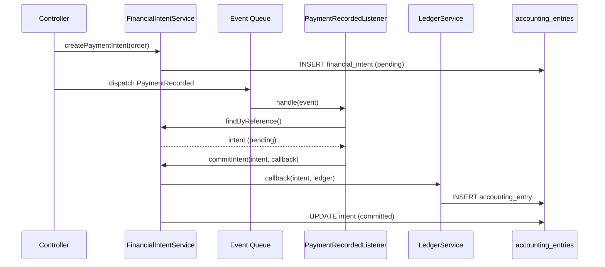

# Architecture Financière - Vue d'Ensemble

## RACINE BY GANDA - Module Finance
**Version**: 1.0  
**Date**: 2026-01-06  

---

## 1. Vision Système

```
┌─────────────────────────────────────────────────────────────────────────┐
│                           RACINE BY GANDA                                │
├─────────────────────────────────────────────────────────────────────────┤
│                                                                          │
│  ┌──────────┐    ┌──────────┐    ┌──────────┐    ┌──────────┐          │
│  │ Boutique │    │Marketplace│    │   POS    │    │   ERP    │          │
│  └────┬─────┘    └────┬─────┘    └────┬─────┘    └────┬─────┘          │
│       │               │               │               │                  │
│       └───────────────┴───────────────┴───────────────┘                  │
│                               │                                          │
│                    ┌──────────▼──────────┐                              │
│                    │   Order / Payment   │                              │
│                    └──────────┬──────────┘                              │
│                               │                                          │
│                    ┌──────────▼──────────┐                              │
│                    │  FinancialIntent    │◄─── Point de vérité         │
│                    └──────────┬──────────┘                              │
│                               │                                          │
│                    ┌──────────▼──────────┐                              │
│                    │   LedgerService     │◄─── Point unique création   │
│                    └──────────┬──────────┘                              │
│                               │                                          │
│                    ┌──────────▼──────────┐                              │
│                    │  AccountingEntry    │◄─── Vérité DB finale        │
│                    └─────────────────────┘                              │
│                                                                          │
└─────────────────────────────────────────────────────────────────────────┘
```

---

## 2. Composants Critiques

| Composant | Rôle | Fichier |
|-----------|------|---------|
| **FinancialIntent** | Intention financière avant réalisation | `app/Models/FinancialIntent.php` |
| **FinancialIntentService** | Création et commit des intents | `app/Services/Financial/FinancialIntentService.php` |
| **LedgerService** | Point UNIQUE de création d'écritures | `modules/Accounting/Services/LedgerService.php` |
| **AccountingEntry** | Écriture comptable (vérité DB) | `modules/Accounting/Models/AccountingEntry.php` |
| **AccountingIdempotenceService** | Observabilité collisions | `app/Services/Financial/AccountingIdempotenceService.php` |

---

## 3. Flux Payment (Intent-Based)



---

## 4. Conformité OHADA

| Exigence | Implémentation |
|----------|----------------|
| Plan comptable | `ChartOfAccount` avec codes OHADA |
| Journaux | VTE (Ventes), ACH (Achats), BNQ (Banque), OD (Opérations Diverses) |
| Exercice fiscal | `FiscalYear` avec dates et clôture |
| Équilibre D/C | CHECK constraint DB + validation applicative |
| Immutabilité | Guard `booted()` sur écritures postées |
| Traçabilité | `created_by`, `posted_by`, `posted_at` |

---

## 5. Technologies

- **Framework**: Laravel 11
- **Base de données**: MySQL 8.0
- **Queue**: Redis / Database
- **Tests**: PHPUnit + Feature Tests
- **CI/CD**: GitHub Actions

---

## 6. Points de Contact

| Rôle | Responsabilité |
|------|----------------|
| Architecte Finance | Évolutions LedgerService |
| DBA | Migrations, constraints |
| DevOps | Queue workers, monitoring |
