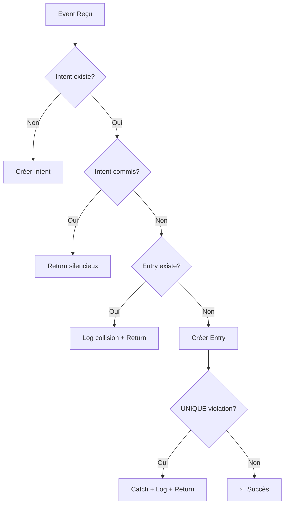

# Stratégie d'Idempotence

## RACINE BY GANDA - Module Finance
**Version**: 1.0  
**Date**: 2026-01-06  

---

## Définition

L'**idempotence** garantit qu'une opération exécutée N fois produit le même résultat qu'une exécution unique.

---

## Importance pour les Systèmes Financiers

| Scénario Dangereux | Sans Idempotence | Avec Idempotence |
|--------------------|------------------|------------------|
| Queue retry | Double écriture | Écriture unique |
| Double-click user | Double paiement | Paiement unique |
| Webhook replay | Double comptabilisation | Comptabilisation unique |
| Crash mid-transaction | État incohérent | Reprise propre |

---

## Architecture Multi-Couche

```
┌─────────────────────────────────────────────────────────────────┐
│                    COUCHE 1: APPLICATION                         │
├─────────────────────────────────────────────────────────────────┤
│  ┌──────────────────┐    ┌──────────────────┐                   │
│  │ Intent Service   │    │ Listener Guard   │                   │
│  │ (idempotency_key)│    │ (EXISTS check)   │                   │
│  └────────┬─────────┘    └────────┬─────────┘                   │
│           │                       │                              │
│           └───────────┬───────────┘                              │
│                       │                                          │
├───────────────────────▼─────────────────────────────────────────┤
│                    COUCHE 2: DATABASE                            │
├─────────────────────────────────────────────────────────────────┤
│  ┌──────────────────────────────────────────────────────────┐   │
│  │        UNIQUE(reference_type, reference_id)              │   │
│  │              ← FILET DE SÉCURITÉ FINAL ←                 │   │
│  └──────────────────────────────────────────────────────────┘   │
└─────────────────────────────────────────────────────────────────┘
```

---

## Mécanismes Implémentés

### 1. Intent-Based Architecture

```php
// Création d'intent avec clé unique
$idempotencyKey = hash('sha256', "{$type}:{$id}");

// Vérification avant création
$existing = FinancialIntent::where('idempotency_key', $key)->first();
if ($existing) return $existing;
```

**Avantage**: Capture l'intention AVANT l'exécution.

### 2. Listener EXISTS Check

```php
// Vérification directe en DB
$existingEntry = AccountingEntry::where('reference_type', 'order')
    ->where('reference_id', $order->id)
    ->exists();

if ($existingEntry) {
    AccountingIdempotenceService::recordCollision(...);
    return; // Retour silencieux
}
```

**Avantage**: Protection rapide, O(1) avec index.

### 3. UNIQUE Constraint DB

```sql
ALTER TABLE accounting_entries 
ADD CONSTRAINT uq_accounting_entries_reference 
UNIQUE (reference_type, reference_id);
```

**Avantage**: Inviolable, même en cas de race condition.

---

## Diagramme de Protection



---

## Observabilité

### Compteur de Collisions

```php
AccountingIdempotenceService::recordCollision(
    referenceType: 'order',
    referenceId: $order->id,
    listener: self::class,
    existingEntryId: $existingEntry->id
);
```

### Log Structuré

```json
{
  "event": "idempotence_collision",
  "reference_type": "order",
  "reference_id": 12345,
  "listener": "PaymentRecordedListener",
  "existing_entry_id": 789,
  "collision_count_24h": 3,
  "timestamp": "2026-01-06T00:30:00Z"
}
```

### Alertes

| Seuil | Action |
|-------|--------|
| 10 collisions/24h | Log warning |
| 50 collisions/24h | Investigation |
| 100 collisions/24h | Alerte critique |

---

## Tests de Validation

| Test | Scénario | Assertion |
|------|----------|-----------|
| `it_creates_only_one_entry_on_double_dispatch` | 2x même event | 1 écriture |
| `it_handles_multiple_retries_gracefully` | 3x retry | 1 écriture |
| `it_prevents_duplicate_entries_under_simulated_concurrency` | 2 instances | 1 écriture |
| `it_returns_existing_intent_on_duplicate_creation` | 2x createIntent | 1 intent |
| `it_returns_existing_entry_on_double_commit` | 2x commit | 1 écriture |

---

## Limites Connues

1. **Race window** entre EXISTS check et INSERT (~1-5ms)
   - **Mitigation**: UNIQUE constraint DB (fallback)

2. **Transactions distribuées** non supportées
   - **Mitigation**: Intent-based avec statuts intermédiaires

3. **Retry max** atteint sans succès
   - **Mitigation**: Alert + dead letter queue + intervention manuelle
