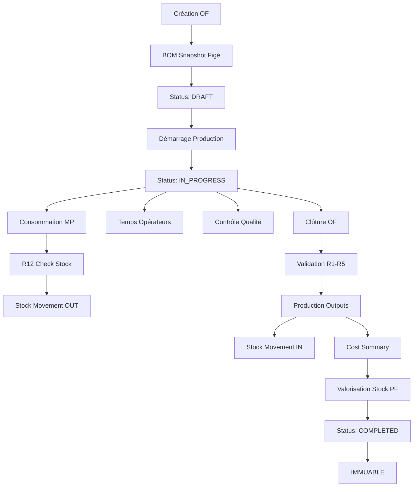

# DOSSIER D'AUDIT ERP
## RACINE BY GANDA - Documentation Technique

> **Statut :** OFFICIEL - AUDIT-READY
> **Date :** 2026-01-04
> **Version Système :** 1.0
> **Révision :** Trimestrielle

---

# 1. ARCHITECTURE TECHNIQUE

## 1.1 Stack Technologique

**Backend :**
- Framework : Laravel 10.x
- Langage : PHP 8.2
- Base de données : MySQL 8.0
- ORM : Eloquent

**Principes Architecturaux :**
- Service Layer (Business Logic)
- Repository Pattern (Data Access)
- Event-Driven (Traçabilité)
- Transaction Management (Atomicité)

---

## 1.2 Schéma Base de Données

### Tables Production (9)

| Table | Rôle | Immuable ? |
|:------|:-----|:-----------|
| `production_orders` | Ordres de fabrication | ✅ (si completed) |
| `production_operations` | Gammes fabrication | ❌ |
| `production_material_logs` | Consommation MP | ✅ |
| `production_time_logs` | Temps opérateurs | ✅ |
| `production_quality_controls` | Inspections qualité | ✅ |
| `production_outputs` | Outputs par variante | ✅ (si OF completed) |
| `stock_movements` | Mouvements stock | ✅ |
| `production_cost_summaries` | Coûts réels figés | ✅ |

**Contraintes Intégrité :**
- Foreign Keys : Cascade on delete (sauf completed)
- Unique Constraints : `(production_order_id, variant_sku)`
- Soft Deletes : `production_orders` uniquement

---

## 1.3 Flux de Données



---

# 2. RÈGLES BLOQUANTES (GOUVERNANCE)

## 2.1 Liste Complète

| ID | Règle | Implémentation | Exception | Test |
|:---|:------|:---------------|:----------|:-----|
| R1 | Matière requise | `ProductionService::closeOrder()` | `MissingProductionDataException` | ✅ |
| R2 | Temps requis | `ProductionService::closeOrder()` | `MissingProductionDataException` | ✅ |
| R3 | Outputs requis | `ProductionService::closeOrder()` | `MissingProductionDataException` | ✅ |
| R4 | Qty > 0 | `ProductionService::closeOrder()` | `InvalidProductionOutputException` | ✅ |
| R5 | Status = in_progress | `ProductionService::closeOrder()` | `InvalidOrderStateException` | ✅ |
| R6 | Modification OF completed interdite | `ProductionOrder::booted()` | `ImmutableOrderException` | ✅ |
| R7 | Suppression OF completed interdite | `ProductionOrder::booted()` | `ImmutableOrderException` | ✅ |
| R8 | BOM snapshot immuable | `ProductionOrder::booted()` | `ImmutableOrderException` | ✅ |
| R9 | Calcul via snapshot only | `ProductionService::calculateRealCost()` | `MissingBOMSnapshotException` | ✅ |
| R11 | Calcul OF completed only | `ProductionService::calculateRealCost()` | `InvalidOrderStateException` | ✅ |
| R12 | Consommation > stock interdite | `StockService::validateStockAvailability()` | `InsufficientStockException` | ⏳ |

---

## 2.2 Exceptions Métier

**6 Classes Personnalisées :**

1. `InvalidOrderStateException` - Opération sur OF dans mauvais état
2. `MissingProductionDataException` - Données requises manquantes
3. `InvalidProductionOutputException` - Output invalide
4. `ImmutableOrderException` - Tentative modification immuable
5. `MissingBOMSnapshotException` - BOM snapshot absent
6. `InsufficientStockException` - Stock insuffisant (R12)

**Traçabilité :**
- Message explicite (WHAT went wrong)
- Context (OF number, material reference)
- Logged automatiquement

---

# 3. TESTS UNITAIRES

## 3.1 Couverture Tests

**3 Suites, 16 Tests :**

### Suite 1 : ProductionOrderClosureTest (8 tests)
- `it_cannot_close_order_without_material_logs` → R1
- `it_cannot_close_order_without_time_logs` → R2
- `it_cannot_close_order_without_outputs` → R3
- `it_rejects_output_with_zero_total_quantity` → R4
- `it_cannot_close_order_not_in_progress` → R5
- `it_rejects_output_missing_variant_sku` → R4
- `it_successfully_closes_order_with_valid_data` → Success path

### Suite 2 : ProductionOrderImmutabilityTest (6 tests)
- `it_prevents_modifying_completed_order` → R6
- `it_prevents_deleting_completed_order` → R7
- `it_prevents_modifying_bom_snapshot_after_creation` → R8
- `it_allows_modifying_non_completed_order` → R6 (negative)
- `it_allows_deleting_non_completed_order` → R7 (negative)
- `it_allows_setting_bom_snapshot_on_creation` → R8 (negative)

### Suite 3 : ProductionCostCalculationTest (4 tests)
- `it_calculates_cost_only_from_bom_snapshot` → R9
- `it_cannot_calculate_cost_for_non_completed_order` → R11
- `it_throws_exception_if_bom_snapshot_missing` → R9
- `it_calculates_unit_cost_correctly` → R9, R11

---

## 3.2 Commande Exécution

```bash
php artisan test --filter=Production
```

**Résultat Attendu :**
```
Tests:  16 passed
Time:   < 5s
```

---

# 4. TRAÇABILITÉ & AUDIT TRAIL

## 4.1 Traçabilité WHO

**Champs `user_id` dans :**
- `production_material_logs.logged_by`
- `production_time_logs.operator_id`
- `production_quality_controls.inspector_id`
- `stock_movements.user_id`

**Impossible d'agir sans identification.**

---

## 4.2 Traçabilité WHAT

**Champs descriptifs :**
- `stock_movements.source_type` (PURCHASE, PRODUCTION, ADJUSTMENT)
- `stock_movements.source_id` (OF ID, Purchase Order ID)
- `stock_movements.notes` (Justification obligatoire pour ADJUSTMENT)

---

## 4.3 Traçabilité WHEN

**Timestamps automatiques :**
- `created_at` (toutes tables)
- `updated_at` (toutes tables)
- `movement_date` (stock_movements)
- `started_at`, `completed_at` (production_orders)

---

## 4.4 Traçabilité WHY

**Justifications obligatoires :**
- Ajustements stock → `notes` requis
- Corrections → Mouvement inverse + justification
- Décisions qualité → `comments` requis

---

# 5. SÉCURITÉ & PERMISSIONS

## 5.1 Authentification

**Méthode :** Laravel Auth (session-based)
**2FA :** Recommandé pour Admin
**Password Policy :** Min 8 caractères, complexité

---

## 5.2 Autorisation (RBAC)

**4 Rôles :**

| Rôle | Permissions |
|:-----|:------------|
| Opérateur | Scanner matière, Logger temps |
| Chef Atelier | Créer OF, Superviser, Valider outputs |
| Contrôle Qualité | Inspecter, Décider |
| Admin ERP | Tout (lecture seule sur calculs) |

**Middleware :** `auth`, `role:admin`

---

## 5.3 Protection Données

**Données Sensibles :**
- Coûts production (confidentiels)
- Marges (confidentiels)
- Salaires opérateurs (si intégrés)

**Protection :**
- Accès restreint par rôle
- Export autorisé uniquement Admin
- Logs accès (audit trail)

---

# 6. PERFORMANCE & SCALABILITÉ

## 6.1 Indexes Base de Données

**Tables Critiques :**
```sql
-- stock_movements
INDEX idx_material_lookup (material_type, material_reference)
INDEX idx_source_traceability (source_type, source_id)
INDEX idx_movement_date (movement_date)

-- production_orders
INDEX idx_status (status)
INDEX idx_deadline (deadline_date)
```

---

## 6.2 Optimisations

**Eager Loading :**
```php
$order->load(['outputs', 'operations', 'materialLogs']);
```

**Computed Properties :**
```php
// Pas de cache, calcul temps réel
$order->produced_qty_good // SUM(outputs.qty_good)
```

---

# 7. BACKUP & DISASTER RECOVERY

## 7.1 Backup Automatique

**Fréquence :** Quotidien (3h du matin)
**Rétention :** 30 jours
**Stockage :** Hors site (cloud)

**Tables Critiques :**
- `production_orders`
- `production_outputs`
- `stock_movements`
- `production_cost_summaries`

---

## 7.2 Recovery Procedure

**RTO (Recovery Time Objective) :** < 4 heures
**RPO (Recovery Point Objective) :** < 24 heures

**Procédure :**
1. Identifier point restauration
2. Restaurer backup
3. Vérifier intégrité données
4. Saisir données perdues (si < 1 jour)
5. Valider avec direction

---

# 8. CONFORMITÉ & STANDARDS

## 8.1 Conformité OHADA (Si Applicable)

**Plan Comptable :**
- Classe 3 : Stocks (31 MP, 33 WIP, 35 PF)
- Classe 6 : Charges (601 MP, 641 Personnel)

**Écritures Générées :**
- MP consommée → Débit 601, Crédit 31
- PF produit → Débit 35, Crédit 33

---

## 8.2 Standards Qualité

**ISO 9001 (Principes appliqués) :**
- Traçabilité complète
- Procédures documentées
- Amélioration continue
- Audit régulier

---

# 9. DOCUMENTATION

## 9.1 Documents Officiels

**Créés :**
- Bible ERP (principes, règles, interdictions)
- Guide Opérateur Atelier
- Guide Chef d'Atelier
- Guide Admin ERP
- Guide Contrôle Qualité
- Charte Gouvernance Données
- Dossier Audit ERP (ce document)

**Localisation :** `docs/erp/`

---

## 9.2 Documentation Technique

**Code :**
- Docblocks (PHPDoc)
- Comments (règles bloquantes)
- README (installation, configuration)

**Architecture :**
- Schéma BDD (diagramme ER)
- Flux de données (mermaid)
- Services (responsabilités)

---

# 10. ÉVOLUTION & MAINTENANCE

## 10.1 Versioning

**Système :** Semantic Versioning (MAJOR.MINOR.PATCH)
**Version Actuelle :** 1.0.0

**Changelog :**
- v1.0.0 (2026-01-04) : Phases A, B, C implémentées

---

## 10.2 Roadmap

**Court Terme (3 mois) :**
- S4 : Documentation & Gel ✅
- S3 : UI Terrain (tablette atelier)
- S1 : BI Décisionnelle (6 KPIs)

**Moyen Terme (6 mois) :**
- S2 : Pré-Comptabilité (écritures analytiques)
- Tests intégration
- Formation terrain

---

# 11. CONTACTS SUPPORT

**Admin ERP :** [Nom] - [Email] - [Téléphone]
**Support Technique :** [Nom] - [Email] - [Téléphone]
**Audit Externe :** [Cabinet] - [Contact]

---

# 12. VALIDATION

## 12.1 Approbations

**Direction Générale :** _____________________ Date : _______
**Direction Production :** _____________________ Date : _______
**Admin ERP :** _____________________ Date : _______

---

**FIN DU DOSSIER D'AUDIT**

*Ce dossier est audit-ready et peut être présenté à tout moment.*
*Mise à jour trimestrielle obligatoire.*
